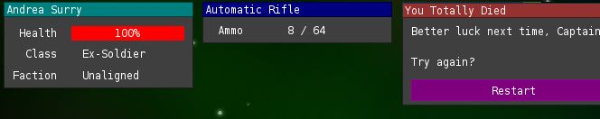

# gdx-immediate-gui
> Immediate-style GUI for Java and libgdx, inspired by
> [imgui](https://github.com/ocornut/imgui).

## Background

This library follows the *immediate* rather than *retained* paradigm of UI
building. You can read more about this idea
[here](http://www.johno.se/book/imgui.html). This style is especially well
suited to quickly creating game UIs with minimal effort.

The library and API is greatly inspired by
[imgui](https://github.com/ocornut/imgui).

## API

`ImmGui` exposes a single static class for all functionality: `Gui`.

### Gui#init(SpriteBatch, ShapeRenderer)

Call this once to initialize. Consumes a libgdx SpriteBatch and ShapeRenderer in
order to do rendering.

### Gui#beginFrame()

Begins a new render frame. Call when you start a new draw frame.

### Gui#endFrame()

End the current frame. This is when drawing actually happens, so call this after
anything that gets rendered beneath the GUI layer.

### Gui#beginWindow(String title)
### Gui#beginWindow(String title, Vector2 position)

Begins a new window. If a `position` is not given, new windows will be placed in
a sequence from the top left of the screen to the top right.

### Gui#setWindowWidth(int)
### Gui#setWindowTitleColour(Color)

Sets the current window's width and colour, respectively. Both will default to
sane values if not provided.

Must be called between a `Gui#beginWindow`/`Gui#endWindow` pair.

### boolean Gui#button(String, Color)

Adds a button to the current window with a given title and colour. Returns true
if the button is currently being clicked with the mouse, and false otherwise.

Must be called between a `Gui#beginWindow`/`Gui#endWindow` pair.

### Gui#label(String)

Adds a label to the current window with the given text.

Must be called between a `Gui#beginWindow`/`Gui#endWindow` pair.

### Gui#progressBar(String caption, Color, float current, float max, boolean showPercent)

Adds a progress bar to the current window. The optional `caption` appears to the
left of the progress bar. `current` and `max` values are used to decide the
progress of the bar. `showPercent`, if set to true, will also draw a label atop
the progress bar indicating a percentage value of its progress.

Must be called between a `Gui#beginWindow`/`Gui#endWindow` pair.

